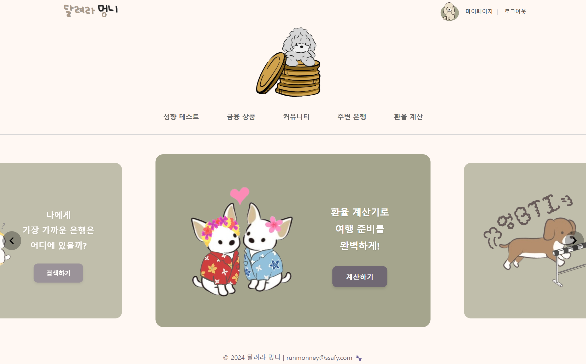
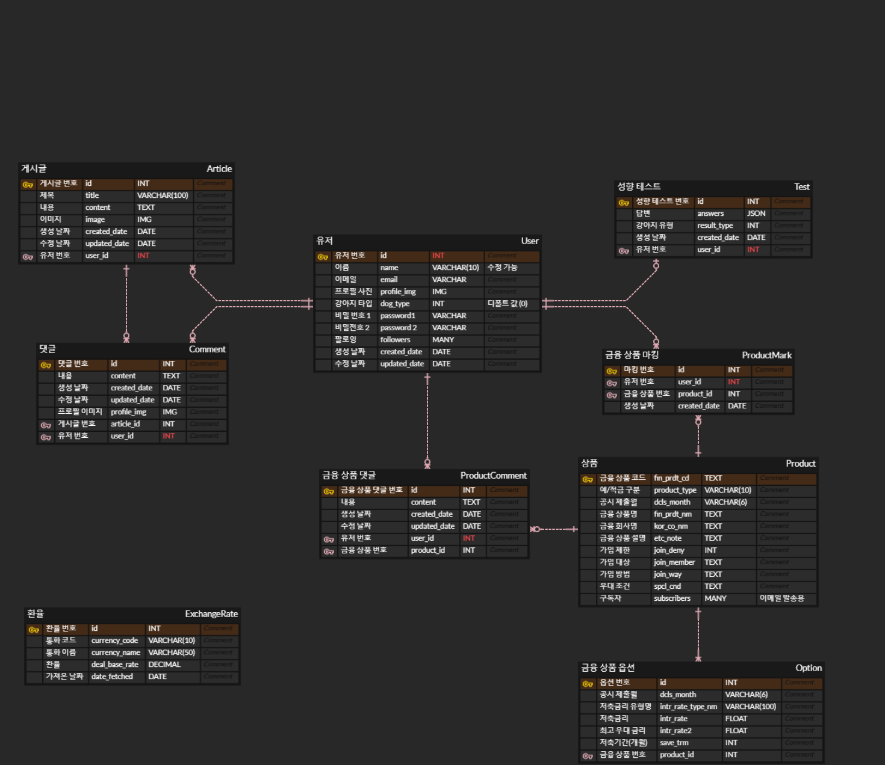
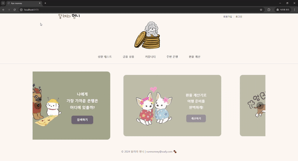
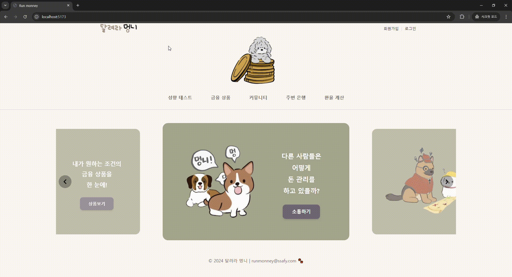
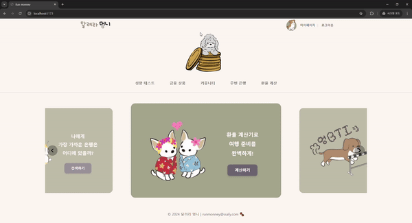
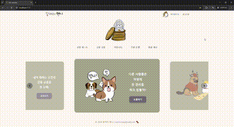
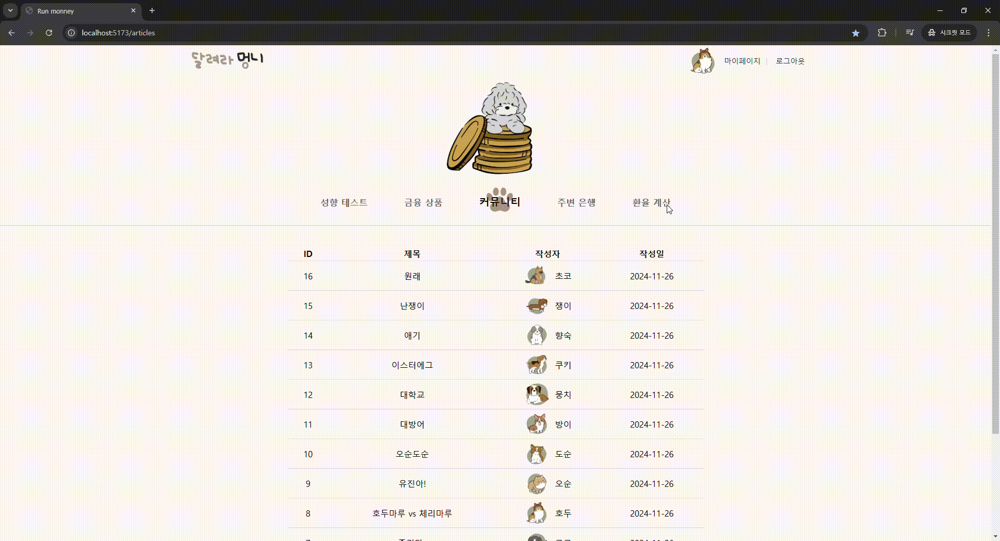
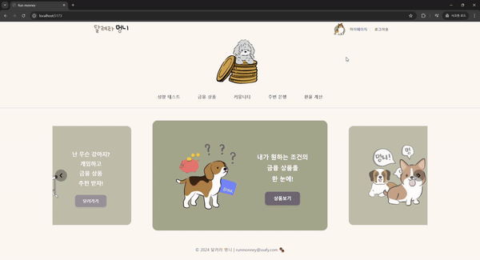
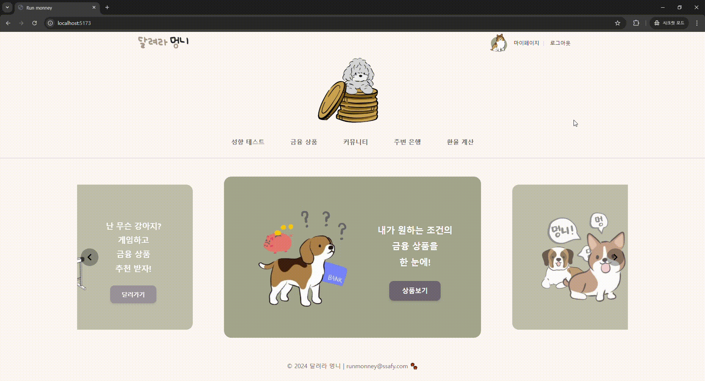
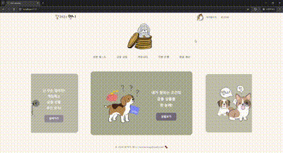

# 달려라 멍니 (Run, Monney)


---

### 📋 프로젝트 개요

- **설명** : 성향에 따른 예적금 상품 추천 및 커뮤니티 서비스

- **기간** : 2024.11.18(월) ~ 2024.11.26(화)

- **팀원**
  
  | 팀원  | 역할                                                                              |
  | --- | ------------------------------------------------------------------------------- |
  | 김아현 | 메인 페이지, 금융 상품 추천 알고리즘, 커뮤니티 게시글 및 댓글 CRUD, 주변 은행 탐색 및 환율 계산기, AI 첫 댓글 생성 서비스    |
  | 임유진 | 회원 커스터마이징, 회원 관리 기능, 성향 테스트 게임, 마이 페이지, 금융 상품 조회 및 필터링, 금융 상품 댓글 CRUD, 금리 비교 차트 |

- **서비스 특징**
  
  - 16종류의 귀여운 강아지와 몽글몽글한 테마 디자인
  
  - '달려라 멍니' 주제곡을 들으며 즐기는 강아지 달리기 게임
  
  - 활발한 소통의 포문을 열기 위한 AI 첫 댓글 생성 서비스
  
  - '알고리즘'과 '데이터 기반' 두 가지 렌즈로 바라본 맞춤형 금융 상품

---

## ⚙️ 기술 스택

### Backend

     

### Frontend

      

### DevOps

 

### Tools

   

### 추가적인 APIs/Services

  -74aa9c?style=for-the-badge&logo=openai&logoColor=white)

---

## 🗂️ 프로젝트 폴더 구조

- Backend - Django
  
  ```
  backend
  ├─accounts
  ├─articles
  ├─exchange
  ├─products
  ├─runmonney
  └─runninggame
  ```

- Frontend - Vue.js
  
  ```
  frontend
  ├─public
  └─src
      ├─api  
      ├─assets
      ├─components
      ├─router
      ├─stores
      |   ├─counter.js
      |   ├─finance.ts
      |   ├─map.js
      |   └─user.js
      └─views
          ├─SignUpView, LogInView, MyPageView, ProfileEditView
          ├─ArticlesView, CreateView, DetailView, UpdateView
          ├─ExchangeView, MapView
          ├─ProductsView, ProductDetailView
          ├─HomeView
          └─TestView
  ```

---

## 🖨 ERD



---

## 💻금융 상품 추천 알고리즘

#### 1. 성향 테스트 기반 추천

사용자의 투자 성향을 16가지 강아지 유형으로 분류하여 맞춤형 금융 상품을 추천합니다.

1. 안정형 (비숑, 푸들, 치와와, 슈나우저)
   
   - 안정적인 수익을 선호하는 성향
   
   - 원금 보장형 예금 상품 위주 추천
   
   - 중위험/중수익 적금 상품 추천

2. 장기투자형 (사모예드, 바셋하운드, 코커스파니엘, 보더콜리)
   
   - 장기적 수익을 추구하는 성향
   
   - 고금리 장기 적금 상품 위주 추천
   
   - 만기 시 우대금리가 높은 상품 추천

3. 모험형 (포메라니안, 파피용, 웰시코기, 불독)
   
   - 높은 수익을 추구하는 성향
   
   - 변동금리 상품 추천
   
   - 특판 상품 위주 추천

4. 목표지향형 (비글, 시츄, 닥스훈트, 저먼셰퍼드)
   
   - 목표 달성을 중시하는 성향
   
   - 목돈 마련형 적금 상품 추천
   
   - 정기 예금 연계 상품 추천

#### 2. 유사 성향 사용자 기반 추천

동일한 강아지 유형을 가진 사용자들의 선호도를 분석하여 추천합니다.

1. 마킹 데이터 수집
   
   - 같은 강아지 유형 사용자들의 마킹 정보 수집
   
   - 금융 상품 별 마킹 횟수 분석

2. 실시간 업데이트
   
   - 금융 상품별 마킹 횟수 지속적 분석
   
   - 새로운 금융 상품 출시 시 즉시 반영

---

## 📌 기능 상세 설명

### 1. 메인 페이지



- nav-bar과 v-carousel을 이용한 메인페이지

- nav-bar에 마우스 오버 시 발자국 호버

- 캐로셀 내 버튼 클릭해도 동일한 페이지로 이동

### 2. 회원 관리

#### 2-1. 회원 가입



- 이름, 이메일, 비밀번호를 입력해 회원 가입 가능

- 회원 가입 성공 시 자동 로그인 및 커뮤니티 게시판 이용 가능

- 회원 가입 직후에는 성향이 정해지지 않은 강아지로 배정

#### 2-2. 로그인 / 로그아웃


- 로그인 여부에 따라 화면 오른쪽 상단 메뉴 변경
  
  - 로그인 시 : 마이페이지, 로그아웃
  
  - 미로그인 시 : 회원가입, 로그인

#### 2-3. 회원 정보 수정 / 비밀번호 변경


- 마이페이지에서 회원 정보 수정 가능

- 이메일은 수정 불가. 이름, 비밀번호만 변경 가능

#### 2-4. 회원 탈퇴


- 회원 탈퇴 시 작성한 게시글, 댓글 모두 삭제

### 3. 게이미피케이션 성향 테스트



- 강아지 달리기 게임 형식의 재미있는 금융 성향 테스트

- 게임 요소와 AI를 이용해 제작한 중독적인 BGM을 통해 사용자의 참여도와 흥미 유발

- 4가지 질문에 대한 O/X 답변을 통해 16가지 강아지 유형으로 분류

- 금융 상품 추천 알고리즘에 따른 예적금 추천 및 마킹 기능 지원

- 분류 결과는 마이페이지에서 재확인 가능

- 재성향 테스트 시 강아지 유형 갱신

### 4. 금융 상품

#### 4-1. 상품 조회



- 금융 감독원 API 활용해 시중은행의 예적금 상품 실시간 금리 정보 제공

- 은행별, 가입 기간별 상품 조회 기능

#### 4-2. 상품 상세 페이지


- 해당 상품군의 기간별 평균 금리와 비교한 차트 제공

- 상품 상세 페이지 내 익명 댓글을 통해 성향별 상품에 대한 솔직한 리뷰 제공

#### 4-3. 상품 마킹(찜)하기


- 마킹 기능을 통한 관심 상품 저장 가능

- 마이페이지에서 마킹한 상품 확인 가능

### 5. 커뮤니티

#### 5-1. 조회


- '달려라 멍니'' 회원들 간 소통 공간

#### 5-2. 게시글 CRUD


- 게시글 작성자만 수정 및 삭제 가능

#### 5-3. 게시글 상세 페이지 / 댓글 CRUD



- 댓글 작성자만 수정 및 삭제 가능

#### 5-4. 팔로우 기능


- '달려라 멍니'' 사용자 간 네트워크 형성

- 사용자 이름 클릭 시 해당 사용자의 마이페이지로 이동

### 6. 주변 은행



- 카카오맵 API 활용

- 도/시, 시/군/구 기준 원하는 은행 찾기

- 해당 은행의 주소, 전화번호 출력

### 7. 환율 계산



- 한국 수출입 은행 API 활용

- 실시간 환율 정보 제공

### 8. 마이페이지



- 사용자의 금융 성향(강아지 유형) 표시

- 팔로워 / 팔로잉 관리

- 작성한 게시글 관리

- 마킹한 금융 상품 관리 및 마킹한 상품들 간 금리 비교 차트 제공

### 9. 금리 변경 시 구독자 이메일 발송


- admin 페이지에서 금리 변경 시, 해당 상품을 마킹한 구독자들에게 이메일 발송

### 10. 생성형 AI 활용

#### 10-1. AI 첫 댓글 생성 서비스


- GPT 기반의 첫 댓글 자동 생성

- 게시글 내용 기반 맥락에 맞는 댓글 작성

- 커뮤니티 활성화 도모

#### 10-2. AI 활용 성향 테스트 BGM 생성

- 성향 테스트 페이지 이동 시, 생성형 AI(SUNO)를 이용해 만든 노래 '달려라 멍니' 재생

#### 11. 이스터에그


- 커뮤니티에 '이스터에그' 제목의 게시글에 힌트 존재

- 로고 클릭 시 강아지의 '멍멍' 소리와 함께 발자국 생성

- 어떤 페이지에 있어도 실행 가능

---

## 💕 최종 진척도

✅ 메인 페이지 (1/1)

✅ 회원 관리 (6/6)

- 회원 가입

- 로그인

- 로그아웃

- 회원 정보 수정

- 비밀번호 변경

- 회원 탈퇴

✅ 성향 테스트(2/2)

- 성향에 따른 금융 상품 추천 알고리즘

- 생성형 AI(SUNO)로 BGM 생성 및 적용

✅ 금융 상품(3/3)

- 상품 조회

- 상품 상세 페이지

- 상품 마킹(찜)하기

✅ 커뮤니티 (3/3)

- 조회

- 게시글 (4/4)
  
  - Creation
  
  - Read
  
  - Update
  
  - Delete

- 댓글 (4/4)
  
  - Creation
  
  - Read
  
  - Update
  
  - Delete

✅ 생성형 AI 활용 첫 댓글 생성 서비스

✅ 팔로우 기능 (1/1)

✅ 주변 은행 (1/1)

✅ 환율 계산 (1/1)

✅ 마이페이지 (1/1)

✅ 금리 변경 시 구독자 이메일 발송 (1/1)

✅ 이스터에그 (1/1)

---

## 🖊️ 소감

- 김아현
  
  : 금융 정보를 최대한 친근하게 전달하고자 노력하였습니다. 그 과정에서 UX가 서비스의 성패를 좌우할 수 있다는 것을 느꼈습니다. 팀원과의 원활한 소통으로 잘 마무리할 수 있었던 것 같습니다.

- 임유진
  
  : API 연동과 데이터 처리 과정에서 실제 서비스 개발의 복잡성을 경험했습니다. 웹페이지 구현을 하고 나니 모바일 앱 버전을 개발하여 사용자 접근성을 향상시키고 싶은 생각이 들었습니다.
